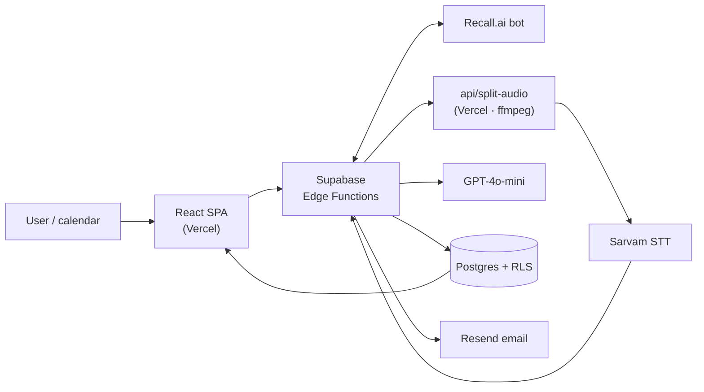

<div align="center">

# EchoBrief

**AI meeting intelligence — records meetings, transcribes any language into English,
extracts decision-grade insights, and delivers structured follow-ups.**

[](https://react.dev)
[](https://www.typescriptlang.org)
[](https://vite.dev)
[](https://supabase.com)
[](https://openai.com)
[](https://tailwindcss.com)

[Documentation](docs/) · [Architecture](docs/architecture.md) · [Pipeline](docs/pipeline.md) · [Errors runbook](errors.md)

</div>

---

## What it does

A Recall.ai bot joins your Google Meet, Zoom, or Teams call — dispatched manually from
a meeting URL, or automatically from a connected calendar. Afterwards the audio runs
through a multi-provider transcription chain and GPT-4o-mini, and you get:

- an executive summary and a detailed one
- action items with owner, priority, confidence, and expected outcome
- explicit decisions and commitments
- risks, open questions, and blockers
- a timestamped meeting timeline
- **computed** conversation metrics — talk time, turn count, longest monologue, participation balance
- **Ask**, a chat interface over your own meeting history, with verified citations
- weekly and monthly digests, delivered by email

Transcription runs in **translate mode**: any supported language in, English out.

---

## Architecture at a glance



Four runtimes, each for a concrete reason. The browser holds no secrets. Edge Functions
own the backend. One function lives on Vercel because it needs real ffmpeg and 2 GB of
memory. Postgres doubles as the scheduler via pg_cron.

Full picture: **[docs/architecture.md](docs/architecture.md)**

---

## Documentation

| | |
|---|---|
| **[Architecture](docs/architecture.md)** | Runtimes, meeting state machine, design principles, trust boundaries |
| **[Pipeline](docs/pipeline.md)** | Every stage from bot dispatch to delivery, the fallback chain, the races it survives |
| **[Chat & analytics](docs/chat-and-analytics.md)** | Retrieval strategy, hygiene filters, and why metrics are computed not generated |
| **[Database](docs/database.md)** | Schema, RLS, migration history |
| **[Edge functions](docs/edge-functions.md)** | All 27 functions — triggers, auth, request/response shapes |
| **[Testing](docs/testing.md)** | Four test tiers, 53 unit tests, 11 integration scenarios, 8 evals |
| **[Operations](docs/operations.md)** | Deploying, cron jobs, alerts, incident playbook, quota ceilings |
| **[Security](docs/security.md)** | Auth, RLS, webhook verification, secrets, data handling |
| **[Contributing](docs/contributing.md)** | Local setup and the rules that are actually enforced |
| **[Errors runbook](errors.md)** | Every error signature, with root cause and recovery |
| **[Engineering notes](docs/engineering-notes.md)** | Long-form write-ups of 24 problems this system hit |

---

## Quick start

```bash
git clone <repo-url> && cd echobrief
npm install
cp .env.example .env      # fill in VITE_SUPABASE_URL and VITE_SUPABASE_PUBLISHABLE_KEY
npm run dev               # http://localhost:8080
```

Edge Functions need `supabase/.env.local`:

```bash
npm run functions:serve
```

Full setup, including every API key: **[docs/contributing.md](docs/contributing.md)**

---

## Commands

```bash
npm run dev              # Vite dev server (:8080)
npm run build            # production build — also the type-check
npm run lint             # ESLint
npm run functions:serve  # Edge Functions locally
npm run test:unit        # 53 deno tests, mocked fetch, <1 s

python3 scripts/pipeline-test/harness.py    # 11 integration scenarios vs real prod (~90 s)
python3 scripts/pipeline-test/harness.py --live   # + real Sarvam E2E (~3 min)
python3 scripts/evals/run_evals.py          # 8 output-quality evals
```

---

## What makes this non-trivial

- **A genuinely async pipeline.** Transcription is submitted and completed by webhook,
  which forces the system to survive duplicate, lost, and out-of-order deliveries.
  Each guard exists because the corresponding failure actually happened.
- **A provider bug root-caused by experiment.** Sarvam's `saaras:v3` silently returns
  empty transcripts for long audio — a 200 with nothing in it. Controlled
  single-variable testing isolated duration as the cause and produced the chunking
  architecture. [Notes #19](docs/engineering-notes.md)
- **Measurements instead of estimates.** Conversation metrics were being generated by
  an LLM, which returned plausible round numbers. They are now computed from segment
  timestamps, and the model's contribution is merged by whitelist because JSON mode
  volunteers fields you deleted from the prompt. [Chat & analytics](docs/chat-and-analytics.md#the-whitelist-merge)
- **Eval-driven AI development.** An integration harness for plumbing, an LLM-judged
  eval suite with a deliberately poisoned calibration case for output quality, and a
  production→eval feedback loop that turns every bad output into a permanent
  regression case. [Testing](docs/testing.md)
- **Operational honesty.** A stuck-meeting monitor that classifies, recovers, and
  alerts; an errors runbook mirrored in code; and a cron cadence tuned against a real
  Disk IO incident rather than guessed at.

---

## Tech stack

**Frontend** React 18 · TypeScript · Vite · Tailwind · shadcn/ui · React Router v6 ·
TanStack Query · Framer Motion

**Backend** Supabase — PostgreSQL with RLS, Auth, Storage, Realtime, Deno Edge
Functions · pg_cron + pg_net

**AI** Sarvam AI `saaras:v3` (primary STT, translate mode) · OpenAI Whisper (fallback)
· GPT-4o-mini (insights, chat, eval judge)

**Integrations** Recall.ai · Google Calendar OAuth · Resend

**Hosting** Vercel (SPA + `api/split-audio`) · Supabase (backend)

---

## License

This project is for portfolio and demonstration purposes.
