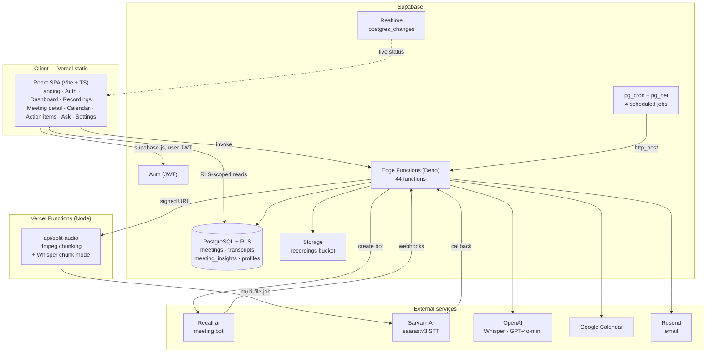
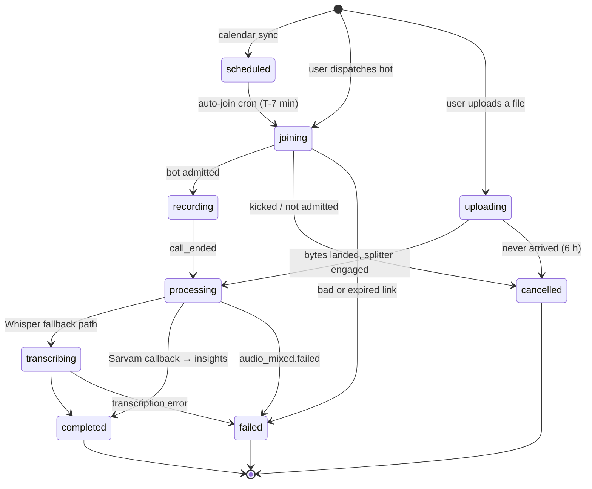

# Architecture

> How EchoBrief is put together, why the boundaries fall where they do, and what
> each runtime is responsible for.

- [System overview](#system-overview)
- [Runtimes and why there are four](#runtimes-and-why-there-are-four)
- [The meeting lifecycle](#the-meeting-lifecycle)
- [Design principles](#design-principles)
- [Trust boundaries](#trust-boundaries)

Related: [Pipeline](pipeline.md) · [Edge functions](edge-functions.md) · [Database](database.md)

---

## System overview

---

## Runtimes and why there are four

| Runtime | Runs | Why it exists separately |
|---|---|---|
| **Browser (React SPA)** | UI, auth session, realtime subscriptions | Static assets on Vercel's CDN. Holds no secrets; every privileged action is an Edge Function call. |
| **Supabase Edge Functions (Deno)** | Ingest, webhooks, OAuth, sync, delivery, monitoring | Co-located with Postgres, service-role access, cheap invocation. The default home for backend logic. |
| **Vercel Function (Node)** | `api/split-audio` only | Needs a **real ffmpeg binary** and ~2 GB of memory to segment long audio. Supabase Edge Functions cap at ~256 MB with no ffmpeg — the same constraint that OOMs the in-edge Whisper path on files above ~15 MB. |
| **Postgres (pg_cron + pg_net)** | 4 scheduled jobs | The database doubles as the scheduler. Free, but write-churn-sensitive — see [Operations § scheduled jobs](operations.md#scheduled-jobs). |

The split is not aesthetic. `split-audio` lives outside Supabase for one concrete
reason (ffmpeg + memory), it is called over HTTPS with a shared bearer secret, and
the caller degrades to direct single-file Sarvam submission when it is unreachable.

---

## The meeting lifecycle

Every meeting is one row in `meetings`, and `status` is the state machine. Nothing
downstream cares *how* the audio was captured — a meeting row plus an audio artifact
is the entire contract.

**`transcribing` is reserved, and it is not a synonym for "being transcribed".** It
means *the chunk-wise Whisper fallback is running* — `sarvam-webhook` sets it before
that fallback and **skips any meeting already in it**, which is what stops Sarvam's
retries from trampling a fallback in progress. A meeting waiting on a Sarvam callback
stays in **`processing`**. Upload ingest learned this the hard way: `ingest-upload`
briefly set `transcribing` after submitting the job, so the callback arrived, matched
the skip-guard and was discarded — the Sarvam job completed, both chunks succeeded, and
the meeting sat in `transcribing` forever with no error anywhere. Only an end-to-end
upload caught it.

**`cancelled` vs `failed` is a deliberate distinction.** A bot removed from the
waiting room never recorded anything and nothing in EchoBrief broke — that is
`cancelled`, a neutral terminal state. A bad or expired meeting link is `failed`,
because the user has something to fix. See
[engineering notes #23](engineering-notes.md#23-kicked-out-bots-looked-identical-to-real-failures--split-into-cancelled-vs-failed).

Terminal statuses (`completed`, `failed`, `cancelled`) are excluded from the
stuck-meeting monitor. Anything else sitting still for >15 minutes gets classified,
recovered if possible, and alerted on.

---

## Design principles

### Ingest-agnostic pipeline

Recording ingest is decoupled from everything downstream. The intelligence layer
knows only about a meeting row and an audio artifact, so the capture mechanism can
change without touching transcription, insight generation, or delivery. This is not
theoretical: v1 captured tab audio from a Chrome MV3 extension, that path was
retired entirely, and the backend below it did not change.

### Multi-provider AI with real fallbacks

Transcription is a chain, not a call:

1. **Sarvam `saaras:v3`** in `translate` mode with diarization — primary, async.
2. **Chunk-wise Whisper** via `split-audio`'s `transcribe: "whisper"` mode — used
   when a chunked Sarvam job stitches to empty. Each 300 s chunk is ~1 MB, far under
   Whisper's 25 MB limit.
3. **Whole-file Whisper** via `process-meeting` with `forceWhisper: true` — short
   recordings only. Long meetings (`audio_duration_seconds > 360` or multi-chunk
   `vercel-ffmpeg`) never take this hop; `process-meeting` itself routes them
   through chunk-wise Whisper instead of the 25 MB upload.

Each hop is triggered by a specific observed failure mode, not by a generic retry.

### Computed, not estimated

Conversation metrics (`speaker_participation`, `silence_percentage`,
`longest_monologue_seconds`, `participation_balance`) are computed arithmetically
from segment timestamps in [`_shared/metrics.ts`](../supabase/functions/_shared/metrics.ts).
They used to come from GPT-4o-mini, which returned plausible round numbers presented
as measurements. The model now contributes exactly one value to that object —
`sentiment_score` — and it is merged in by **whitelist**, not by object spread. See
[Chat & analytics](chat-and-analytics.md#conversation-metrics).

### Backend modularity

Shared logic lives in [`_shared/`](../supabase/functions/_shared/) rather than being
duplicated across functions:

| Module | Responsibility |
|---|---|
| `recall-pipeline.ts` | Recall bot/transcript fetch, audio download, speaker timeline, Sarvam submission |
| `sarvam.ts` | Sarvam job create / upload / start / output discovery / ordered download |
| `stitch.ts` | Pure chunk-stitch math — offsets, sorting, empty-chunk counting |
| `whisper-chunked.ts` | Long-meeting detection + split-audio Whisper client |
| `insights.ts` | Hallucination detection, GPT prompt, insight persistence, delivery gating |
| `metrics.ts` | Pure conversation metrics + the model-output whitelist merge |
| `cors.ts` | Origin allowlist and preflight |
| `rate-limit.ts` | In-memory sliding-window limiter |

`stitch.ts` and `metrics.ts` were extracted specifically so they could be unit-tested
without a deployment — they are pure, synchronous, and have no clock or randomness.

### Async-first, webhook-driven

Transcription is not request/response. Jobs are submitted and completed later by
callback, which forces the system to survive: duplicate deliveries (idempotency
guards), lost deliveries (`check-recall-status` re-fires under an atomic lock),
out-of-order deliveries (`bot.done` before `audio_mixed.done`), and provider bugs
(empty output → fallback chain).

---

## Trust boundaries

| Boundary | Enforcement |
|---|---|
| Browser → Postgres | Row Level Security on `auth.uid() = user_id`. The anon key is public by design; RLS is the actual control. |
| Browser → Edge Functions | Caller's JWT forwarded. `chat-transcripts` deliberately uses the **caller's token, not the service role key**, so RLS scopes retrieval. |
| Edge Functions → Postgres | Service role. These functions are the only place that bypasses RLS. |
| Recall → `recall-webhook` | Signature verification on the raw body before parsing. |
| Sarvam → `sarvam-webhook` | Callback `auth_token` set at job-creation time. |
| Edge Functions → `split-audio` | `Authorization: Bearer ${SPLIT_AUDIO_SECRET}`, shared between Supabase secrets and Vercel env. |
| `monitor_events` | Service-role only; no user-facing policy. |

See [Security](security.md) for the full model.
