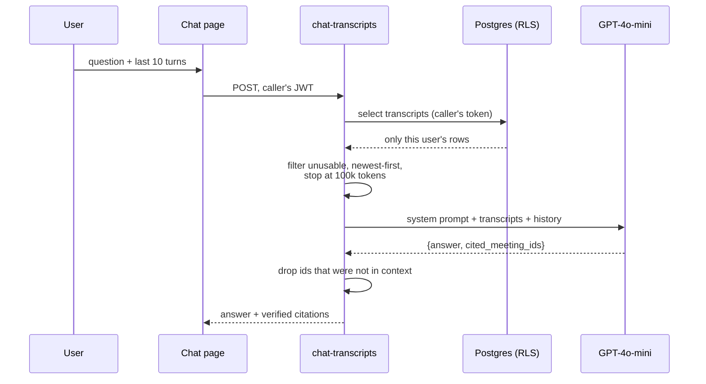

# Chat and Conversation Analytics

> Two features shipped 2026-08-20 that sit on top of the pipeline rather than inside
> it: asking questions across your own meeting history, and measuring conversations
> instead of asking a model to estimate them.

- [Ask: chat over transcripts](#ask-chat-over-transcripts)
- [Why context-stuffing, not vector search](#why-context-stuffing-not-vector-search)
- [Retrieval hygiene](#retrieval-hygiene)
- [Citations](#citations)
- [Conversation metrics](#conversation-metrics)
- [The whitelist merge](#the-whitelist-merge)

---

## Ask: chat over transcripts

Route `/chat` → [`src/pages/Chat.tsx`](../src/pages/Chat.tsx), backed by the
[`chat-transcripts`](../supabase/functions/chat-transcripts/index.ts) Edge Function.



**Security posture.** The function builds its Supabase client from the **caller's
`Authorization` header and the anon key** — not the service-role key. RLS decides
what the query returns. Chat is the single feature where a scoping mistake exposes
another user's private meeting content, so that guarantee is enforced in Postgres
rather than by an application-level `user_id` filter that a refactor could silently
drop.

---

## Why context-stuffing, not vector search

The retrieval strategy is deliberate, and it is the interesting decision in this
feature.

| | Context-stuffing (chosen) | Embedding pipeline |
|---|---|---|
| Moving parts | One query | Embed-on-write job, vector store, index, backfill |
| Failure mode | Ceiling hit → explicit `truncated: true` | Silent drift → *"chat doesn't know about that meeting"* |
| Distinguishable from a bad model? | Yes | **No** |
| Fits today's corpus? | Yes — average transcript ≈ 2,126 tokens | Overkill |

The deciding argument was the failure mode, not the cost. An embedding pipeline that
falls behind produces an answer that looks exactly like an unhelpful model, and there
is no signal that anything is wrong.

`buildContext()` is written as an explicit **seam**: it returns every transcript the
caller can read, newest first, accumulating until `MAX_CONTEXT_TOKENS` (100,000). Every
response reports `context_meetings`, `context_tokens`, and `truncated`, so the token
log shows the ceiling approaching well before anyone hits it. When it does, ranked
retrieval replaces the body of that one function and nothing else changes.

---

## Retrieval hygiene

Three classes of row are genuinely present in this database, and all three make
answers worse by being in context:

1. **The "no clear speech" placeholder** the pipeline writes when a recording captured
   nothing. Without a filter, the model quotes it back as if it were a finding *about*
   the meeting.
2. **Sub-threshold fragments** — `"Hmm hmm. Hello Can you hear me?"` — no content, but
   still citable.
3. **`[harness]` test meetings**, whose fabricated "quarterly roadmap" transcript would
   otherwise be answered as though it were the user's own work.

```ts
const MIN_TRANSCRIPT_CHARS = 250;
const NO_SPEECH_SENTINEL = "no clear speech was detected";

function isUsableTranscript(title: string, content: string): boolean {
  if (title.startsWith("[harness]")) return false;
  if (content.trim().length < MIN_TRANSCRIPT_CHARS) return false;
  if (content.trim().slice(0, 120).toLowerCase().includes(NO_SPEECH_SENTINEL)) return false;
  return true;
}
```

The count of filtered rows is returned as `skipped` and logged. When *everything* is
filtered out, the user gets an honest message — "the ones on file captured no clear
speech" — rather than a generic "no transcripts found", which would be false.

---

## Citations

The model is asked for `cited_meeting_ids`, and **every id is checked against the
context set before it reaches the client.** Models invent plausible UUIDs; an
unverified citation is worse than none, because it looks like provenance.

```ts
const byId = new Map(items.map((m) => [m.meeting_id, m]));
const citations = citedIds.filter((id) => byId.has(id)).map(/* … */);
```

---

## Conversation metrics

[`_shared/metrics.ts`](../supabase/functions/_shared/metrics.ts) computes everything
below from segment timestamps. Pure, synchronous, no I/O, no clock, no randomness —
and covered by 25 unit tests.

| Metric | Definition |
|---|---|
| `speaker_participation[]` | Per speaker: `seconds`, `percentage` (of **speech**, not wall-clock), `turns`, `questions`, `words`, `words_per_minute` |
| `total_speaking_seconds` | Sum of segment durations |
| `silence_percentage` | `(duration − speech) / duration`, clamped to [0, 100] |
| `turn_count` | Number of speaker changes |
| `total_words`, `words_per_minute` | Across all speech; `null` when there is no speech time |
| `lead_in_silence_seconds` | Dead air before the first word |
| `trailing_silence_seconds` | Dead air after the last word |
| `longest_monologue_seconds` / `_speaker` | Longest **uninterrupted** stretch |
| `participation_balance` | `1 − Gini` over per-speaker seconds. `1` = perfectly even. **`null` below two speakers.** |

### Why these are computed, not generated

`meeting_metrics` used to come from GPT-4o-mini. On meeting `7261568f` it reported
`duration_seconds: 300` for a 664-second meeting whose speech spans ~500 seconds — a
plausible round number presented as a measurement. Every segment already carries exact
start and end times. There is nothing to estimate.

### Monologues are gap-aware

A silence longer than **15 seconds** ends a monologue:

```
const MONOLOGUE_GAP_SECONDS = 15;
```

Without it, "longest uninterrupted stretch" quietly means "total time this speaker
held the floor" — a different and much larger number. The same meeting reported a
244.94 s stretch that contained 36 gaps, one of them 62 seconds long. The longest
genuinely continuous speech was **21 seconds**.

### `participation_balance` is null for solo meetings

Balance describes a relationship between speakers. With one speaker there is nothing
to describe, and a Gini of 0 would render as a perfect 1.00 score — flattering
nonsense. It returns `null`, and the dashboard hides the card entirely, adapting the
grid to the remaining cards.

---

## The whitelist merge

`mergeMeetingMetrics` is a **whitelist, not a spread**:

```ts
return {
  ...computed,
  ...(Number.isFinite(sentiment) ? { sentiment_score: sentiment } : {}),
};
```

Removing `engagement_score` from the prompt does **not** stop gpt-4o-mini from
volunteering it in JSON mode. Observed in production on 2026-08-20: a plain
`{...model, ...computed}` merge let `engagement_score: 80` back into the row, because
no computed key shadowed it. Only keys the code names survive.

`sentiment_score` is the one model value kept, because it is a genuine judgment call
rather than a measurement the transcript already contains.

> **Known wart:** the prose section of the insights prompt still asks for an
> "Engagement score (0-100)" even though the JSON schema below it omits the field.
> The whitelist makes this harmless, but the prompt and schema disagree and the prompt
> should be trimmed.
