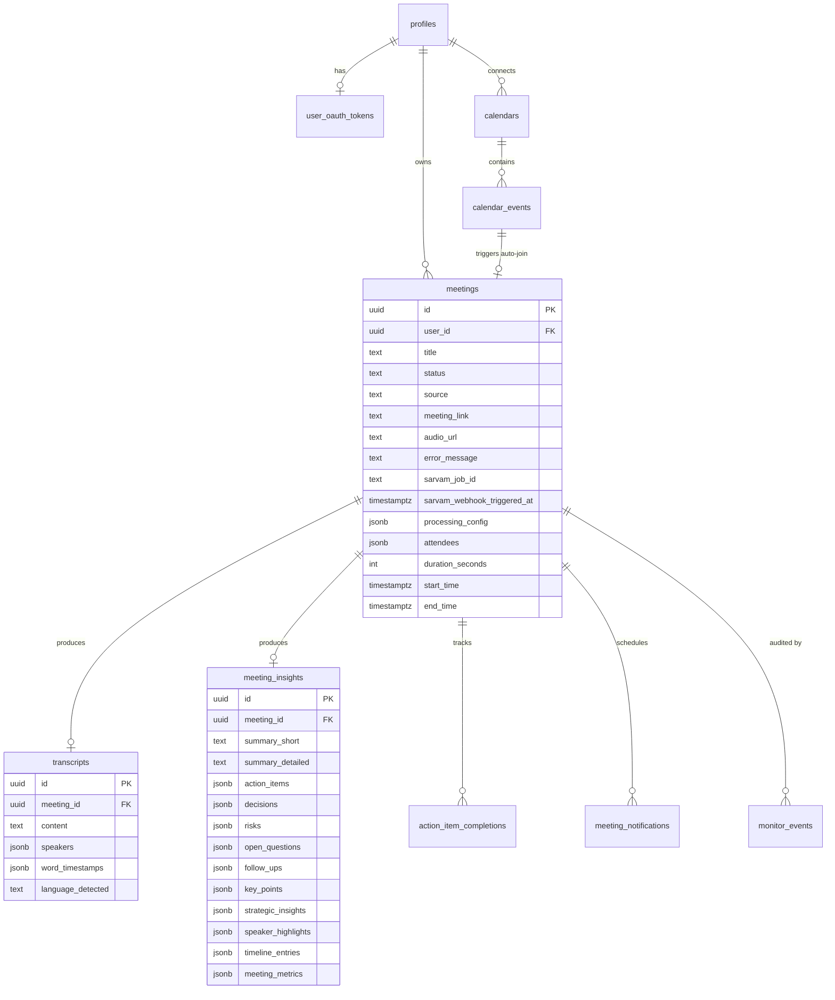

# Database

PostgreSQL on Supabase, with Row Level Security on every user-scoped table.

- [Entity model](#entity-model)
- [Core tables](#core-tables)
- [Integration tables](#integration-tables)
- [Operational tables](#operational-tables)
- [Row Level Security](#row-level-security)
- [Migrations](#migrations)
- [Regenerating types](#regenerating-types)

---

## Entity model



---

## Core tables

### `meetings`
The centre of the product model — it connects recording source, processing state,
transcript, insights, and delivery. Columns that carry pipeline semantics:

| Column | Role |
|---|---|
| `status` | The state machine: `scheduled` → `joining` → `recording` → `processing` / `transcribing` → `completed` \| `failed` \| `cancelled`. Free text, no enum — new states need no migration. |
| `error_message` | Human-readable failure reason surfaced in the UI. **Added late** — every failure-path UPDATE silently no-op'd for weeks before it existed. |
| `sarvam_job_id` | The Sarvam batch job this meeting is waiting on. |
| `sarvam_webhook_triggered_at` | Atomic recovery lock for `check-recall-status`. Deliberately **not** `status`. |
| `sarvam_webhook_claimed_at` | Atomic in-flight claim taken by `sarvam-webhook` on a terminal callback, so Sarvam's ~8 s callback retries skip instead of re-running the pipeline. Claims older than 10 min are re-claimable, so a died-mid-way run never strands a meeting. |
| `processing_config` | JSONB: `chunk_count`, `chunk_seconds`, `split_method`, `recall_speaker_timeline`, `recall_participants`. |
| `source` | How the meeting was captured / created. |

### `transcripts`
One row per meeting: `content` (full text), `speakers` (JSONB segment array with
`speaker`, `text`, `start`, `end`), `word_timestamps`, `language_detected`.

### `meeting_insights`
One row per meeting, insert-only in practice — `saveInsights` checks for an existing
row and no-ops. Regenerating insights means deleting the row first.

`meeting_metrics` is the merged object: everything computed in
[`_shared/metrics.ts`](../supabase/functions/_shared/metrics.ts) plus **only**
`sentiment_score` from the model, merged by whitelist. See
[Chat & analytics](chat-and-analytics.md#conversation-metrics).

### `profiles`
User settings and integration flags: `auto_join_enabled`, `email_summaries_enabled`,
`notetaker_name`, `bot_color`, `preferred_languages`, `onboarding_completed`,
`pre_meeting_notification_minutes`, `google_calendar_connected`.

### `action_item_completions`
Per-user completion state for an action item, addressed by
`(meeting_id, action_item_index)` — the action items themselves live in the
`meeting_insights.action_items` JSONB array.

---

## Integration tables

| Table | Purpose |
|---|---|
| `user_oauth_tokens` | Google access/refresh tokens and expiry |
| `google_oauth_states` | CSRF state + `return_to` for the OAuth round trip |
| `calendars` | Connected calendars per user, with sync flags and `last_synced_at` |
| `calendar_events` | Synced events, including `meeting_link` extraction that drives auto-join |
| `meeting_notifications` | Scheduled pre-meeting notifications |
| `waitlist` | Signup waitlist capture |
| `digest_reports` / `digest_schedules` | Digest generation and cadence |
| `scheduled_emails` / `email_messages` | Delivery queue and log |

**Removed 2026-08-20:** `slack_messages`, `notion_connections`, and the Slack columns
on `profiles`. Those integrations are gone from the product — see migrations
`20260820130000_remove_slack.sql` and `20260820140000_remove_notion.sql`.

---

## Operational tables

### `monitor_events`
Audit trail of every stuck-meeting detection. **Service-role only** — no user-facing
RLS policy. Deduped by a generated `hour_bucket` column so a persistently stuck
meeting produces one row per signature per hour rather than one per cron tick.

This is what the pipeline harness asserts against, because the alert email itself is
suppressed for test meetings.

### `email_deliveries`
One row per summary email that has been sent, keyed
`(meeting_id, lower(recipient_email), kind)` by a **unique index**. **Service-role
only.** `send-meeting-email` INSERTs the row before it calls Resend, so a racing
caller gets `23505` and skips instead of sending a second copy; the row is deleted
again if the send then fails, so a retry can still deliver. `kind` keeps the
automatic `meeting_summary` separate from other mail, so a manual re-send is never
blocked by the automatic one.

Added 2026-08-21 after Sarvam replayed one callback three times and the user
received three identical summaries — see [`engineering-notes.md`](engineering-notes.md) #24.

---

## Row Level Security

Every user-scoped table enforces `auth.uid() = user_id`. This is the real access
control, not a convenience: the anon key is shipped to the browser by design, so
Postgres is the only thing standing between one user's session and another user's
meetings.

Two consequences worth internalising:

- **`chat-transcripts` uses the caller's JWT**, not the service role. Chat is the one
  feature where a scoping bug leaks another user's private meeting content, so the
  guarantee belongs in Postgres rather than in an application-level filter that a
  future refactor could drop.
- **Edge Functions using the service role bypass RLS entirely.** Any new function
  that filters by `user_id` in application code is one forgotten `.eq()` away from a
  leak. Prefer the caller's token wherever the operation is genuinely user-scoped.

---

## Migrations

Migrations live in [`supabase/migrations/`](../supabase/migrations/) and are applied
in filename order. The ones that carry non-obvious history:

| Migration | What it fixed |
|---|---|
| `20260314010000_sarvam_migration.sql` | Adds `sarvam_job_id`, `processing_config` |
| `20260422170000_sarvam_webhook_trigger_lock.sql` | Adds `sarvam_webhook_triggered_at`, decoupling recovery from the `transcribing` sentinel |
| `20260424170000_meetings_error_message.sql` | Adds `error_message` — the column every failure path had been writing to for weeks without it existing |
| `20260425170000_monitor_events.sql` | Monitor audit trail |
| `20260425170100_monitor_stuck_meetings_cron.sql` | Monitor cron schedule |
| `20260613120000_reduce_cron_frequency.sql` | Auto-join 1→5 min, monitor 5→15 min. Those `net.http_post` calls were **94.4% of all DB execution time** and were depleting the Disk IO Budget |
| `20260613120100_prune_cron_pgnet_bookkeeping.sql` | Daily prune of `cron.job_run_details` + `net._http_response` |
| `20260820150000_autojoin_dedup_unique_index.sql` | Unique index that makes duplicate-bot dispatch impossible rather than merely unlikely |
| `20260820160000_prune_recordings_cron.sql` | Daily audio prune after the storage cap incident |
| `20260821180000_email_delivery_dedup.sql` | `email_deliveries` claim table + `meetings.sarvam_webhook_claimed_at`. Makes three identical summary emails for one meeting impossible rather than merely unlikely |

`cron.schedule()` with an existing job name **updates that job in place** — that is
why the frequency migrations re-declare the jobs rather than unscheduling first.

---

## Regenerating types

`src/integrations/supabase/types.ts` is generated and drifts. Regenerate after any
migration:

```bash
supabase gen types typescript --project-id <project-id> > src/integrations/supabase/types.ts
```

> As of this writing the checked-in types are behind the schema — they omit
> `meetings.error_message`, `sarvam_job_id`, `sarvam_webhook_triggered_at`,
> `processing_config`, and the `monitor_events` / `digest_reports` tables. Edge
> Functions do not use this file, so nothing is broken; frontend code touching those
> columns will need a regenerate first.
