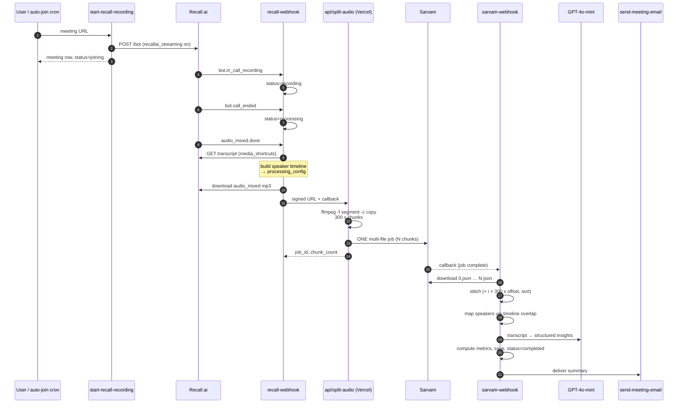
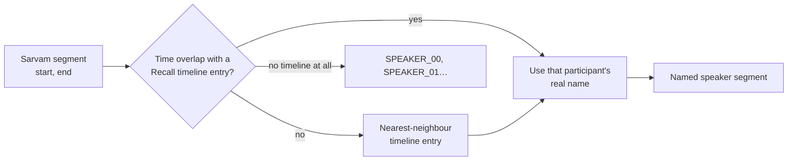
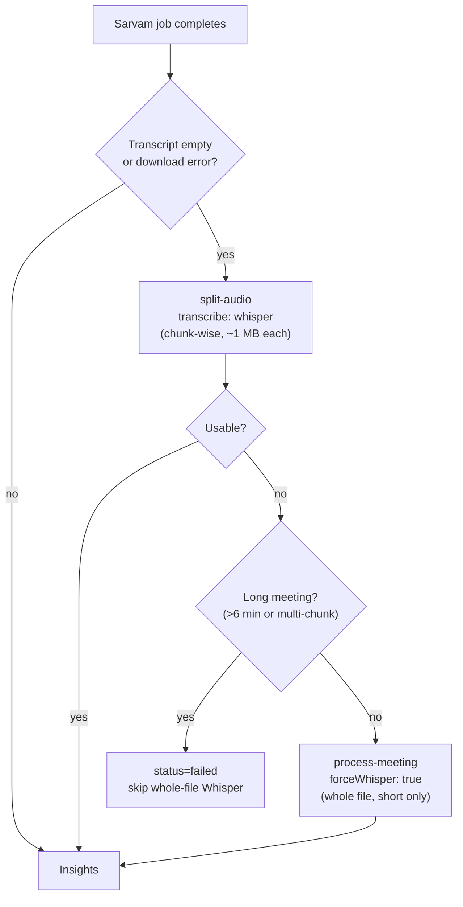

# The Recording Pipeline

> From "user pastes a meeting URL" to "summary lands in the inbox" — every hop,
> every fallback, and the reason each one exists.

- [Happy path](#happy-path)
- [Stage 1 — bot dispatch](#stage-1--bot-dispatch)
- [Stage 2 — Recall lifecycle](#stage-2--recall-lifecycle)
- [Stage 3 — audio handoff and chunking](#stage-3--audio-handoff-and-chunking)
- [Stage 4 — Sarvam callback and stitching](#stage-4--sarvam-callback-and-stitching)
- [Stage 5 — speaker attribution](#stage-5--speaker-attribution)
- [Stage 6 — insights and delivery](#stage-6--insights-and-delivery)
- [The fallback chain](#the-fallback-chain)
- [Race conditions the pipeline survives](#race-conditions-the-pipeline-survives)

Related: [Architecture](architecture.md) · [Edge functions](edge-functions.md) · [Errors runbook](../errors.md)

---

## Happy path



---

## Stage 1 — bot dispatch

Two entry points, one code path:

- **Manual** — the user pastes a Google Meet / Zoom / Teams URL in the dashboard.
- **Automatic** — the `auto-join-meetings` cron runs every 5 minutes and dispatches
  a bot to any calendar event starting within the next **7 minutes**.

> The look-ahead window must stay **≥ the cron interval**, or meetings fall between
> polls. The wider window is safe because a per-calendar-event dedup guard (backed by
> a unique index on `calendar_event_id`) prevents duplicate bots on successive runs.

[`start-recall-recording`](../supabase/functions/start-recall-recording/index.ts)
creates the bot with real-time transcription enabled (`recallai_streaming`) and
inserts the `meetings` row at `status = joining`.

## Stage 2 — Recall lifecycle

[`recall-webhook`](../supabase/functions/recall-webhook/index.ts) verifies the
signature against the raw body, then maps events to status:

| Recall event / code | Meeting status |
|---|---|
| `recording_permission_allowed`, `in_call_recording` | `recording` |
| `call_ended` | `processing` |
| `call_ended` with a known terminal sub-code | `cancelled` or `failed` (see below) |
| `bot.fatal` | classified sub-code, else `failed` |
| `audio_mixed.failed` | `failed` |
| `audio_mixed.done` | → stage 3 |

Terminal sub-codes are split into two maps in the source:

```
CANCELLED_SUB_CODES   bot_kicked_from_waiting_room
(never recorded,      bot_removed_from_waiting_room
 nothing broke)       bot_not_accepted
                      timeout_exceeded_waiting_room

FAILURE_SUB_CODES     cannot_join_meeting
(user must fix)       meeting_not_found
```

A bot kicked **after** it started recording is untouched by this — it still emits
`audio_mixed.done` and completes into a normal summary.

## Stage 3 — audio handoff and chunking

On `audio_mixed.done`, [`_shared/recall-pipeline.ts`](../supabase/functions/_shared/recall-pipeline.ts):

1. Fetches Recall's own transcript via the `media_shortcuts.transcript` download URL
   (the old `/bot/{id}/transcript/` endpoint is deprecated) to get **real participant
   names** and build a speaker timeline of `{speaker, start, end}` entries, stored in
   `meetings.processing_config`.
2. Downloads the `audio_mixed` mp3 and archives it to the `recordings` bucket.
3. Hands the signed URL to `SPLIT_AUDIO_URL` with a bearer secret.

### Why chunking exists

Sarvam's `saaras:v3` **silently returns an empty transcript for long audio.** Not an
error — a 200 with nothing in it. Root-caused on 2026-06-09 by controlled experiment:
a 47-minute file fails; 5–6 minute chunks of *the same file* succeed. Config-invariant,
therefore server-side.

[`api/split-audio.ts`](../api/split-audio.ts) segments anything over **360 s** into
**300 s** chunks and submits them as **one multi-file Sarvam job**.

### Why stream-copy, not re-encode

Recall's `audio_mixed` is already **16 kHz mono 128 kbps mp3** — exactly Sarvam's
preferred input. Re-encoding it is pure generation loss. Measured on a real 29-minute
recording (2026-08-20):

| Method | Segment time | Sarvam output | Non-empty chunks |
|---|---|---|---|
| `-c copy -segment_format mp3` | **0.21 s** | 28,426 chars | 6/6 |
| `-c:a libmp3lame -q:a 4` | 2.44 s | 28,557 chars | 6/6 |

0.5% apart in output, 12× faster. The function stream-copies first and falls back to
a real re-encode only if that yields no chunks — `getAudioDownloadUrl` can return an
mp4 `video_url`, which will not stream-copy into mp3.

> An earlier note claimed stream-copy was rejected with *"Audio contains no samples"*.
> That attempt almost certainly omitted `-segment_format mp3`, leaving ffmpeg to infer
> a container. The claim was wrong and has been retired.

### Time budget

`vercel.json` pins `maxDuration` to 300 s (the Hobby ceiling). A 66–72 minute meeting
must download ~46 MB, segment 15–20 chunks and upload them all inside that window.
When it silently didn't, the caller fell back to whole-file Sarvam, which returns
empty for long audio, and the meeting completed with nothing in it. Two mitigations:
uploads run at concurrency 6, and a **270 s budget** turns an overrun into an explicit
logged 504 instead of a silent partial submission.

## Stage 4 — Sarvam callback and stitching

[`sarvam-webhook`](../supabase/functions/sarvam-webhook/index.ts) reads
`chunk_count` and `chunk_seconds` from `processing_config`, downloads outputs
`0.json … N.json` in **numeric** order, and calls
[`stitchChunkResults`](../supabase/functions/_shared/stitch.ts):

- chunk *i*'s timestamps are offset by `i × chunk_seconds`
- entries are **re-sorted by start time** afterwards — Sarvam's diarization emits
  slightly out-of-order entries when speakers overlap, and both the dashboard
  timeline and the `stitch_integrity` eval expect monotonic segments
- empty chunks (silence) are skipped but counted
- `language_code` is the first non-null chunk language

## Stage 5 — speaker attribution

Sarvam's diarization in `translate` mode frequently assigns **every segment to one
`speaker_id`**, even in a multi-person meeting. Mapping per-`speaker_id` therefore
collapses everyone into one name. Mapping is done **per segment** instead:



If the timeline is missing — Recall's transcript can lag behind `audio_mixed.done` —
the webhook **retries fetching speaker context once** and writes the recovered
timeline back into `processing_config` before mapping. Without that retry, measured
on 2026-08-20, only 1 in N meetings resolved real names.

## Stage 6 — insights and delivery

[`_shared/insights.ts`](../supabase/functions/_shared/insights.ts) runs the transcript
(speaker-labelled where available) through GPT-4o-mini in JSON mode and persists to
`meeting_insights`. Guards worth knowing:

- **Hallucination detection** (`isLikelyHallucination`) rejects the classic Whisper
  artefacts — `"Thanks for watching"`, `"Please subscribe"`, repeated `"you"` — and
  any text with a unique-word ratio below 0.2 across ≥5 words.
- **Below 20 characters of transcript**, insight generation is skipped entirely and a
  fixed "no clear speech was detected" summary is written. Chat retrieval later filters
  these rows out on purpose.
- **`saveInsights` only inserts.** It checks for an existing row and no-ops if one
  exists — it will never update. Regenerating insights requires deleting the row first.
- **Delivery** is gated on `profiles.email_summaries_enabled` (default true), and
  suppressed unconditionally for `[harness]`-titled meetings unless `HARNESS_EMAILS=true`.

### Post-transcription passes (2026-08-31)

Between speaker attribution and insight generation, both `sarvam-webhook` and
`process-meeting` run the same sequence, all in `_shared/`:

1. **Language** (`language.ts`) — script-ratio detection per segment; the meeting gets a
   duration-weighted mix in `meetings.languages` (`{"en": 0.78, "hi": 0.22}`) instead of
   Sarvam's single job-level label, which tagged a 78%-English call "hindi".
2. **Leak translation** (`translate-leaks.ts`) — Sarvam's translate mode leaks untranslated
   Devanagari on Hinglish audio. Segments tagged `hi`/`mixed` go through one batched
   gpt-4o-mini call; the original text stays on `segment.original_text`. Non-fatal.
3. **Entity correction** (`vocab.ts`) — vocabulary from calendar attendees (names, email
   local parts, domain-root company names) plus `profiles.custom_vocabulary`; tight
   Levenshtein budgets fix near-misses ("AltaFlock" → "Oltaflock") and every change is
   logged to `processing_config.entity_corrections`. Never rewrites content.
4. **Boundary zones** (`zones.ts`) — external attendee = email domain different from the
   owner's. The window is estimated from when externals speak in Recall's timeline
   (45 s pad before, 20 s after) and stored in `meetings.boundaries` with
   `source: "speech_estimated"`; segments carry `zone: pre|meeting|post`. Internal-only
   meetings trim nothing. **Everything downstream — insights, metrics (timestamps shifted
   to the window), coaching, the email, the MCP surface — sees the meeting zone only.**
   The full transcript is still stored; the UI shows the internal zones behind an
   owner-only toggle.
5. **Two-pass insights** (`facts.ts` + `insights.ts`) — extraction emits `facts`
   (numbers, entities, pain points, objections, buying signals, explicit asks,
   commitments, decisions, risks, topics, notable quotes — each with a verbatim `quote`
   and `ts`, plus a `meeting_type`); synthesis writes prose from the facts object only;
   validation checks each summary claim against the facts and records
   `facts.validation.unverified`. Action items, decisions, timeline and highlights are
   assembled deterministically from facts; spoken due dates resolve to IST calendar dates
   (`dates.ts`: "Tuesday" said Fri Aug 28 → `due_date_resolved: 2026-09-01`). If any pass
   fails the legacy single-shot prompt runs — a meeting never loses its summary to a new
   stage.
6. **Coaching** (`coaching.ts`) — benchmarked verdicts (rep talk ratio vs 45 %, monologue
   vs 60 s, questions, hedge-word density) plus one LLM pass for moment flags
   (`objection_ignored`, `numbers_mismatch`, `pitched_before_discovery_complete`,
   `next_step_secured` + strength), a per-2-minute sentiment timeline for the external
   participant, and a coach's summary. Skipped for internal-only meetings; non-fatal.

The whole sequence adds roughly 60–90 s to the callback. The regression fixture is
meeting `f09a4803` (`scripts/evals/dataset/case_live_f09a4803.json`).

---

## The fallback chain



Each hop maps to a documented failure in [`errors.md`](../errors.md):

| Trigger | Signature | Fallback |
|---|---|---|
| Sarvam returns 200 with empty transcript | `sarvam:silent_empty_output` | chunk-wise Whisper |
| Sarvam server bug on long audio | `sarvam:keyerror_timestamps` | chunk-wise Whisper |
| Sarvam download error of any kind | — | chunk-wise Whisper; whole-file only if the meeting is short |
| Long meeting, chunk-wise Whisper fails | `whisper:audio_too_large` (legacy) | none — whole-file Whisper is skipped |
| Whisper on a large file in-edge | `whisper:oom` | chunk-wise Whisper via `split-audio` |

## Race conditions the pipeline survives

| Race | Symptom without the guard | Guard |
|---|---|---|
| `bot.done` arrives before `audio_mixed.done` | Good meetings marked `failed` | Handler queries Recall's `/audio_mixed/` endpoint directly. Only `failed`/`missing` fail the meeting; `done`, `processing`, `unknown` defer. |
| Sarvam callback never arrives | Meeting stuck in `processing` forever | `check-recall-status` claims the trigger with an atomic `sarvam_webhook_triggered_at IS NULL` update, then re-fires the webhook. |
| Two Sarvam callbacks for one job | Duplicate transcripts, duplicate emails | `sarvam-webhook` skips meetings already `completed`; `saveInsights` is insert-only. |
| Recovery deadlock | The `transcribing` status sentinel blocked its own recovery | The lock lives in a **dedicated column**, not in `status`, so the Whisper-fallback skip-guard and the recovery path no longer contend. |
| Auto-join fires twice in one window | Two bots in one meeting | Unique index on the calendar event, plus a per-event dedup check. |

Every one of these has a harness scenario asserting it — see [Testing](testing.md).
