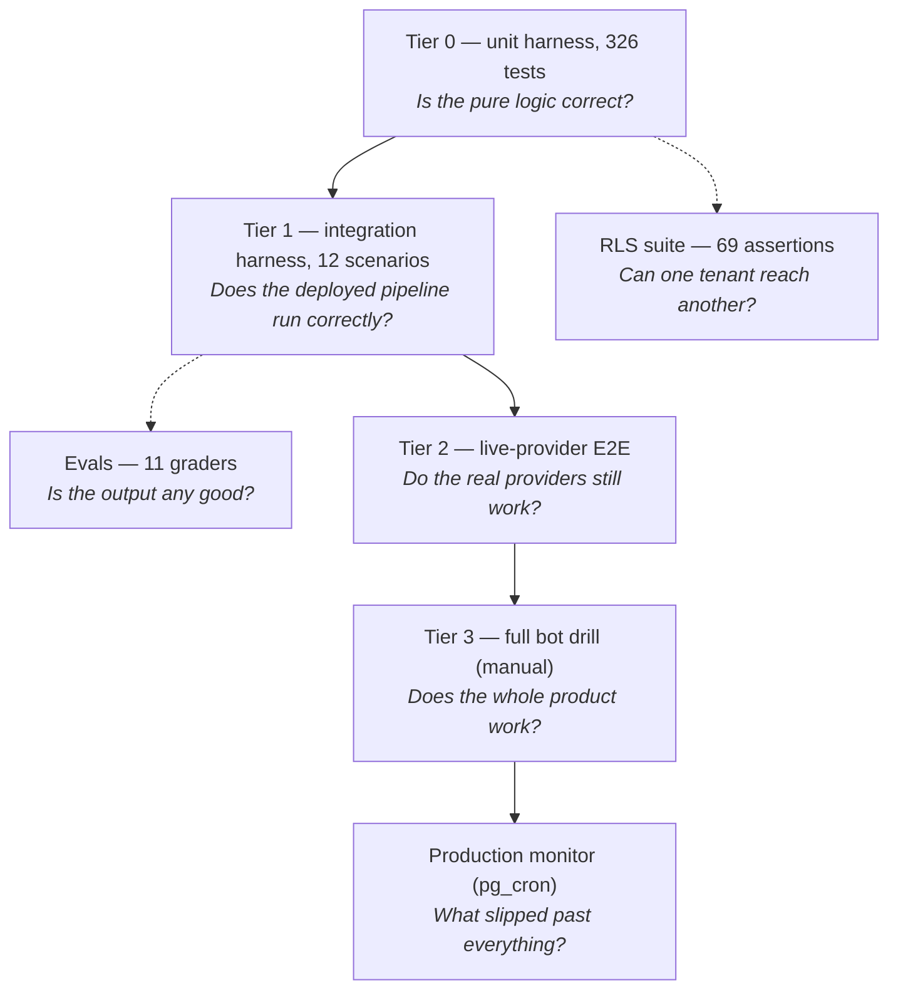

# Testing

> Four tiers, an output-quality suite and a tenant-isolation suite. Each answers a
> different question at a different cost, and none of them substitutes for another.

- [The pyramid](#the-pyramid)
- [Tier 0: unit harness](#tier-0-unit-harness)
- [Tier 1: integration harness](#tier-1-integration-harness)
- [Tier 2: live-provider E2E](#tier-2-live-provider-e2e)
- [Tier 3: full bot drill](#tier-3-full-bot-drill)
- [Output-quality evals](#output-quality-evals)
- [Tenant isolation](#tenant-isolation)
- [Pre-deploy gates](#pre-deploy-gates)

---

## The pyramid



| Tier | Command | Cost | When |
|---|---|---|---|
| **0. Unit** | `npm run test:unit` | free, <1 s | every change |
| **1. Integration** | `python3 scripts/pipeline-test/harness.py` | ~90 s, real prod | before every deploy — 12/12 must pass |
| **2. Live E2E** | `harness.py --live` | ~3 min, pennies | before risky pipeline deploys |
| **3. Bot drill** | manual runbook | ~5 min human | after bot-flow changes |
| **Evals** | `python3 scripts/evals/run_evals.py` | seconds | before anything touching transcription or prompts |
| **Isolation** | `npm run test:rls` | ~30 s, real prod | before anything touching a policy, a table, or sharing |

A meeting can flow through every status correctly and still produce a hallucinated
summary — the harness stays green, only an eval catches it. Conversely, an idempotency
race never shows up in output quality — only the harness catches it. The production
monitor is the last leg: it catches what slips past everything, *in* production, after
the fact.

---

## Tier 0: unit harness

Pure-logic tests with mocked `fetch` — no deployment, no database, no providers.
**326 tests across 40 files.** The largest, and what each one is really protecting:

| File | Tests | Covers |
|---|---|---|
| `entitlements.test.ts` | 31 | Plan resolution, pooled workspace usage, the fail-open on a usage-read error |
| `metrics_test.ts` | 28 | Participation, silence, gap-aware monologues, null balance, the whitelist merge |
| `recall_pipeline_test.ts` | 17 | Recall transcript URL discovery + fallbacks, `getAudioMixedStatus` defer semantics |
| `calendar_connections_test.ts` | 14 | Provider-neutral connection reads, Google/Microsoft shapes |
| `crypto_test.ts` | 13 | AES-256-GCM seal/open, key selection, the plaintext-read policy |
| `zones_test.ts` | 12 | Privacy boundary zones — what counts as pre/meeting/post |
| `whisper_chunked_test.ts` | 12 | Chunk-wise Whisper fallback ordering and failure paths |
| `time_test.ts` | 11 | IST formatting and the email subject line |
| `summary_recipients_test.ts` | 10 | Allowlist ∩ attendees, minus the owner; never throws |
| `feedback_prompts_test.ts` | 10 | Prompt eligibility and send-once semantics |
| `cost_test.ts` | 10 | The metering Proxy around the injected OpenAI client |

The remaining 29 files cover the rest of `_shared/` — dates, vocab, coaching, sarvam,
stitch, share tokens and views, oauth tokens, audit, observability, dodo, webhooks,
CORS and rate limiting, email brand and delivery, and the `[harness]` email gate.
Regenerate the totals rather than trusting this table:

```bash
for f in supabase/functions/tests/*.ts; do
  printf '%-46s %s\n' "$(basename "$f")" "$(grep -c 'Deno.test' "$f")"
done | sort -k2 -rn
```

```bash
npm run test:unit        # deno test -A supabase/functions/tests/
```

`stitch.ts` and `metrics.ts` were extracted from their callers *precisely* so they
could be tested this way: pure, synchronous, no clock, no randomness.

---

## Tier 1: integration harness

**12 scenarios against real infrastructure** (13 with `--live`).

Nothing is mocked. Each scenario inserts a synthetic `[harness]`-prefixed meeting into the production database, fires real signed webhook payloads (captured from prod logs, templated in [`fixtures.py`](../scripts/pipeline-test/fixtures.py)) at the real deployed edge functions, polls for the expected end state, and always cleans up its rows — pass or fail. A run that is killed outright cannot, so every run starts by sweeping `[harness]` rows older than three hours left behind by an earlier one (`--cleanup-only` sweeps them all, at any age).

```bash
python3 scripts/pipeline-test/harness.py                       # 12 default scenarios (~90 s)
python3 scripts/pipeline-test/harness.py --live                # + live_sarvam_e2e (real Sarvam, ~3 min)
python3 scripts/pipeline-test/harness.py --only chunked_happy_path   # one scenario
python3 scripts/pipeline-test/harness.py --cleanup-only        # delete stray [harness] rows
```

All 12 default scenarios, in plain words:

| Scenario | What it checks |
|---|---|
| `happy_path_sarvam` | A normal finished transcription turns into a completed meeting with the transcript and insights actually saved. |
| `chunked_happy_path` | A multi-chunk job is stitched back in the right order, with each chunk's timestamps shifted into real meeting time. |
| `speaker_mapping_happy_path` | Diarized segments get real names (Priya/Rahul) by matching speaking times, and a segment outside every window falls back to the nearest speaker — never a generic `SPEAKER_01`. |
| `split_audio_endpoint_probes` | The deployed Vercel splitter is alive and configured: it answers `401` with no auth and `400` on an empty body (a `500` here means its env vars are missing). |
| `bot_done_defers_on_unknown_audio` | When Recall fires its two "done" events at the same moment, a good meeting is never wrongly marked failed. |
| `audio_mixed_failed_marks_meeting_failed` | A real audio failure actually saves `failed` to the database (the bug where a missing column silently swallowed the update). |
| `bot_kicked_waiting_room` | A bot kicked from the waiting room ends as `cancelled` (neutral, not `failed`), not stuck forever. |
| `duplicate_sarvam_webhook_idempotency` | A replayed Sarvam callback is skipped, not re-processed into a duplicate transcript. |
| `concurrent_sarvam_webhooks` | Two callbacks arriving at once: exactly one processes, the other loses the in-flight claim and skips. |
| `summary_email_deduped_per_recipient` | A summary already sent to a recipient is never sent again — `send-meeting-email` skips before it reaches Resend. Sends no mail. |
| `monitor_recovers_known_pattern` | The monitor recognizes a known stuck-signature and runs its canonical recovery. |
| `monitor_logs_unknown_pattern` | The monitor flags a never-seen signature and writes the `monitor_events` audit row. The alert email is suppressed for `[harness]` meetings unless `HARNESS_EMAILS=true` is set. |

(Behind `--live`, a 13th scenario `live_sarvam_e2e` runs — described in Tier 2 above.)

## Tier 2: live-provider E2E

`live_sarvam_e2e` runs the real E→F→G chain: a 6.5-minute Hindi fixture stored at `recordings/harness-fixtures/live-e2e.mp3` goes through the deployed splitter, becomes a real 2-chunk Sarvam batch job with the real webhook callback, and must come back `completed` with >100 chars, `stt_provider=sarvam`, insights present, and an accurate `duration_seconds`. If Sarvam ships another silent regression, this is the test that screams.

## Tier 3: full bot drill

The only stages no automation covers are bot creation and joining (A–B) — they need a real meeting. After changing bot-flow code or before re-enabling auto-join:

1. Open a Google Meet yourself (instant meeting is fine).
2. In the EchoBrief dashboard, paste the Meet URL and start a bot recording.
3. Admit the bot when it knocks; play 2–3 minutes of any video with clear speech.
4. End the meeting. Within ~5 minutes the meeting should reach **Completed** with a transcript, named speakers (you), and insights.
5. If it sticks, the monitor will classify and email within 15–20 min — check `monitor_events` for the signature.

**Debugging a failing scenario:** every failure message states the expected vs actual end state (e.g. `meeting never reached completed; final status='processing'`). The triage order that works: (1) re-run just that scenario with `--only`; (2) check the edge function logs in the Supabase dashboard for the function the scenario fires at; (3) check `monitor_events` / meeting row state via the REST API; (4) if the failure is a *new* pipeline behavior (not a regression), update the scenario's expectation **and** document the behavior change in `errors.md`. Harness runs send no email by default — summary delivery and monitor alerts are both skipped for `[harness]`-titled meetings. To verify real Resend delivery end-to-end, set the `HARNESS_EMAILS=true` Supabase secret for that run (subject `[ECHOBRIEF HARNESS TEST]`), then unset it.

One design detail worth noting: the chunked scenario injects ordered chunk results through an explicit `__harness_inline` test seam in `sarvam-webhook` rather than creating a real Sarvam job (slow, costly, non-deterministic). Production callbacks never set the flag, so prod always downloads outputs by name — the seam tests the stitch logic without weakening the production path.

## Output-quality evals

Run modes:

```bash
python3 scripts/evals/run_evals.py                    # static dataset gate (exit code gates deploys)
python3 scripts/evals/run_evals.py --skip-llm         # deterministic evals only (free, no OpenAI)
python3 scripts/evals/run_evals.py --meeting-id <id>  # grade a live production meeting
python3 scripts/evals/run_evals.py --snapshot <id>    # pull a prod meeting into the dataset as a regression case
```

**Deterministic evals** (pure python, free):

1. `schema_validity` — insights have a non-empty summary and list-typed action_items/decisions
2. `english_output` — translate mode actually produced English (ASCII ratio ≥ 0.95)
3. `stitch_integrity` — segments time-ordered, non-negative, non-empty, last timestamp within meeting duration + slack
4. `speaker_attribution` — zero phantom `SPEAKER_XX` labels when real participant names are known

**LLM-judge evals** (gpt-4o-mini, temperature 0, strict JSON responses):

5. `action_item_recall` — gold action items semantically covered by generated ones (gate ≥ 0.7)
6. `action_item_precision` — every generated action item grounded in the transcript; **a single hallucinated item fails the eval** (gate = 1.0)
7. `summary_faithfulness` — the summary is split into claims and each claim checked against the transcript (gate ≥ 0.9)
8. `decision_accuracy` — gold decisions covered (gate ≥ 0.7)

**Calibration — a scorer that never fails is indistinguishable from one that cannot fail.** The 9-case dataset carries a **negative control per scorer**: a case built to break exactly one property, declaring `"expect": {"<scorer>": "fail"}`, so the suite passes only when the scorer *catches the plant*.

| Case | Must fail | Stands in for |
|---|---|---|
| `synthetic_hallucination` | `action_item_precision`, `summary_faithfulness` | An invented action item ("hire two backend contractors") and a fabricated summary claim ("double the marketing budget") — the judge drifting lenient |
| `synthetic_devanagari_leak` | `english_output` | Translate mode regressing and leaving Devanagari in the output |
| `synthetic_stitch_broken` | `stitch_integrity` | A chunk-offset bug — invisible in the prose, visible only in the timestamps |
| `synthetic_phantom_speakers` | `speaker_attribution` | Speaker mapping leaving raw `SPEAKER_XX` labels when real names are known |
| `synthetic_entity_misspelling` | `entity_spelling` | The vocabulary pass not running, so a customer's company name stays mangled |
| `synthetic_boundary_leak` | `boundary_exclusion` | Private waiting-room speech summarised into the insights |

If one of these starts passing, the scorer went blind — **fix the scorer, not the case.**

`synthetic_boundary_leak` is the instructive one: its summary is entirely *faithful* to
the transcript, because the leaked line really was said. Faithfulness and privacy are
different properties, and a suite grading only the first would call that output perfect.

The judge retries transport failures (dropped connection, 5xx, 429) with backoff and
never retries a 4xx or an answer it dislikes. Two different transient network errors
failed the gate on consecutive runs on 2026-09-07; every case added multiplies the judge
calls, so an unretried blip would make spurious deploy-blocking failures routine.

**Fixing a failing eval:** first decide which of three things failed — (a) the *pipeline* genuinely regressed → fix the pipeline (this is the eval doing its job); (b) the *judge* mis-graded → tighten the judge prompt and re-verify against the calibration case; (c) the *gold reference* is wrong or stale → fix the dataset case. Never "fix" an eval failure by deleting the case or lowering a gate without understanding which of the three it was.

**The feedback loop (production → eval):** when a prod meeting produces a bad output, `--snapshot <meeting-id>` freezes its transcript+insights into `dataset/` as a permanent case; adding hand-written `gold.action_items`/`gold.decisions` activates the recall/accuracy graders on it. That failure mode can then never silently regress — the same discipline as adding a regression test for every bug, applied to AI output quality.

**Proof it works:** on its very first live run, the suite caught a real production defect — Sarvam's diarization emits out-of-order segments on overlapping speech (4 of 331 segments in the recovered 47-minute meeting), which `stitch_integrity` flagged and no human or status check had noticed (Engineering Challenge #20). The fix shipped the same hour and is now permanently regression-guarded by both a harness scenario and an eval.

---


## Tenant isolation

`npm run test:rls` ([`scripts/rls-test/harness.py`](../scripts/rls-test/harness.py))
answers the one question no other tier asks: **can one customer reach another's data?**

It creates two real users on the deployed project, gives each a meeting, transcript,
insight, contact and webhook event, and then asserts across every table PostgREST
exposes — it enumerates the schema, so a table added next week is either classified or
reported as uncovered — that neither can read, update, delete or forge ownership of
the other's rows. It also checks anonymous reads, a random share token and a Supabase
JWT pasted into the share URL.

**It carries its own controls, and that is the interesting part.** A green isolation
run proves nothing by itself: *"user A saw none of user B's rows"* is equally true when
the policy is airtight and when the table is empty. The first version of this suite was
exactly that — it seeded `transcripts` with a column that does not exist, the insert
returned 400, nothing checked the status, and the most sensitive table in the product
reported PASS over zero rows.

| Control | Asserts | Why it exists |
|---|---|---|
| Positive | the victim's own token can **see** each seeded row | if the owner cannot read it, the attacker's failure to read it means nothing — the assertion is vacuous, and vacuous fails here |
| Detection | the **service-role** key, which bypasses RLS, **must** report a leak on every seeded table | if it reports none, the detector is broken and every PASS above it is noise |

The detection control is how "prove it fails when a policy is widened" is satisfied
without widening a real policy on a production database. Verified 2026-09-07: a clean
run exits 0 at 69/69; a run with the leak check deliberately broken exits 1 naming the
offending table.

Every seed insert is status-checked and fatal, because a silent seed failure is
indistinguishable from a passing test.

Run it for **any migration, any new table, any RLS policy edit, and any change to
sharing, organisations or the public API**. Like the harness and the evals it is not in
CI — it creates and deletes real auth users against production.

---

## Pre-deploy gates

```bash
npm run lint             # ESLint
npm run build            # type-check + production build
npm run test:unit        # 326 deno tests, <1 s
npm run test:rls         # 69 isolation assertions, if you touched a policy or a table
python3 scripts/pipeline-test/harness.py     # 12/12 against real prod
python3 scripts/evals/run_evals.py           # 11 evals, exit code gates the deploy
```

Run these before deploying an Edge Function or a migration. Add `--live` to the
harness before risky pipeline changes. Full deploy procedure in
[Operations](operations.md#deploying).

See also [`scripts/evals/EVALS.md`](../scripts/evals/EVALS.md) for the
harness-vs-evals distinction and how to grow the dataset.
